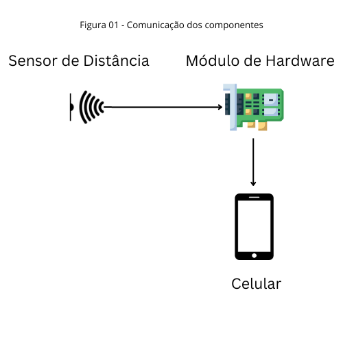

## 1. Introdução
  A deficiência visual, em qualquer grau, compromete a capacidade de uma pessoa de se orientar a si própria e
mover-se no espaço de forma segura e independente. Em 2010,dados do IBGE (Instituto Brasileiro de Geografia e Estatística) a deficiência visual estava presente em 3,4% da população brasileira.

Objetivo Geral
Objetivos Específicos
## 2. Trabalhos Relacionados
## 3. Solução Proposta

### 3.1. Arquitetura da Solução
A solução é composta por três módulos: o celular, o módulo de hardware (ESP32-WROOM-32), e o sensor de distância, ilustrado na Figura 01. 
O sensor capta um determinado objeto a uma distância predefinida, e esta informação é passada para o hardware (ESP32-WROOM-32), que notifica o celular de que há um objeto nas proximidades.Com isso, o mesmo emite vibrações indicado que há um objeto próximo ao usuário.

### 3.2. Materiais e Métodos
### 3.2.2. O Módulo de Hardware

# 4. Conclusões e Trabalhos Futuros

# Referências
[1] GIL, M. MINISTÉRIO DA EDUCAÇÃO SECRETARIA DE EDUCAÇÃO A DISTÂNCIA C A D E R N O S D A Deficiência Visual. [s.l: s.n.]. Disponível em: <http://portal.mec.gov.br/seed/arquivos/pdf/deficienciavisual.pdf>.Acessado em: 23/11/2022.

